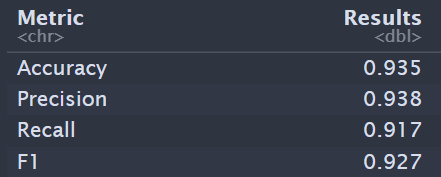

# Airline Passenger Satisfaction Classification using H2o AI

The airline passenger satisfaction survey dataset can be found [here](https://www.kaggle.com/datasets/teejmahal20/airline-passenger-satisfaction).

This dataset contains an airline passenger satisfaction survey. We used H2o AI to determined the best model to predict passenger satisfaction (Binary response). 

There are 103,904 observations and 22 predictors on the "training" set. The training set was randonly split for validation and training. The There is only one variable Arrival_Delay_in_Minutes that contains about 0.3% NA values. Random forest was used to replace missing values.Data manipulation was performed on data such as correcting variables types, strings manipulation, performing one-hot encoded on categorical variables.

From the training data set, H2O AI was used to select the best model to predict satisfaction of passenger. H20 selected a stacked ensemble model which uses different models to make a prediction. The table below shows the base models and the meta model (GLM) that were used. 

The stacked ensemble model has a 0.985 area under the curve on the validation dataset. 

Next the model the predictions of satisfaction are performed on the testing dataset which contains 5195 observations. The final stacked ensemble model performed well with and area under the curve of 0.98. The confusion table is shown below. The columns are the prediction and the rows and the actual values.  

The table below shows accuracy, precision, recall, and F1 score. Overall the model performed well in predicting satisfaction. The model can still be adjusted to improved results.

